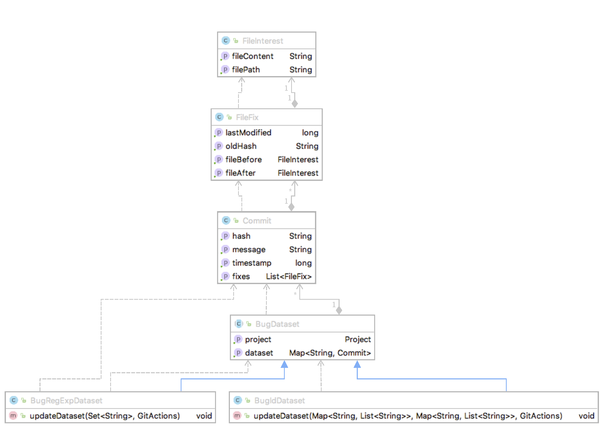

# Bug Collector Package

[](https://opensource.org/licenses/Apache-2.0)

## What is it?

The bug collector package from frameVPM project contains a tool that leverage information gathered by the Data7 tool to create a bug fix dataset. 
Indeed to retrieve the highest possible number of vulnerabilities in a project, data7 try to link reference of bug id as mentioned in vulnerability report to ones present in commit message. If a match is done then the commit is flagged as vulnerability fix. To prevent from analyzing over and over the same commits and thus provide faster update, a map of bugid to commit is stored in the dataset by the data7 tool.
 This map that was created solely for this purpose can as well allow the creation of a bug fix dataset and that's what this tool offer.

Similarly to the Data7 tool, the dataset created by the bug collector tool can easily be updated with the latest version of the vulnerability dataset. The information that can be found in the dataset is the following:

list of commits that fixed a bug which contains:

- hash
- timestamp
- message
- fixes (files in their states before and after fix)
    
## Why? 

All software projects have their history of bugs, whether these are due to design error or mistake of the developers. To analyse their origin and find techniques to uncover them, many bug dataset have been created. Yet, most of them are not considering vulnerabilities specifically. Indeed vulnerabilities are often considered as a subset of bugs, which means that the distinction is not mandatory. However, to understand what's make a vulnerability a vulnerability as opposed to a bug, a distinction is required. The dataset generated by the tool is complementary to the one generated by the data7 one and allow one to do this analysis and even try to find whether some reported bug were in fact vulnerabilities.

In the context of the frameVPM, the generated dataset allows to studies how well VPM differentiate between bugs and vulnerabilities, but other usage can be conceive like how well a defect prediction model react to just bugs, as opposed to bugs and vulnerabilities.

## Requirements

To create and update a bug dataset, only a configured installation of the data7 tool is required.
Maven will handle the dependancy.

## How does it work ?
For a given dataset DV generated by the Data7 tool for a project P, two case arise either the project declare the bug id in the commit message either they just mention a bug correction. In the first case, the dataset DB can be generated from D, in the other case a second pass through all the commits is required.

* Bug Id present in commit
    - for each bug id found in DV
        - if( the bug id is not attach to a vulnerability)
            - for each commit attach to the bug id, not yet present in DB add commit information to DB
        - else check whether the bug has not been added previously in DB, if its the case remove it from DB (the case arise when updating DB)   
        
            
* Only mention a fix
    -for each commit not yet processed by a former run
        - look for mention to a fix in the commit message, if found add commit information to DB
    - once done check whether commits in DB are used in DV, if it is the case remove them from DB
    


## Dataset Structure
          
The dataset generated by the tool is only available through its binary serialized form and can be access through the following api:


When calling upon the creation or the update of a dataset, a BugDataset will be returned. However due to the two different cases, different implementations of the bugDataset are needed in order to create/update the dataset. Hence depending of the categories presented above the project falls within, either a BugIdDataset object will be returned (first case), or a BugRegExpDataset object will be returned. Yet, this is only for internal calls, from the user perspective, no difference exist between both. Indeed to create/update a dataset, the user will call the function updateOrCreateBugDataset() that will handle the categorisation of the project and thus the calls to make and will return a BugDataset which is the parent of both class and only offer access to information on the Project and the list of Commit objects the dataset is composed of.

As a remainder, a Commit Object contains the hash, the message and the timestamp of the commit as well as the list of files that were modifier (FileFix Object).

A FileFix Object contains information on time the file was last modified before the given commit and its corresponding previous hash as well as the file in its state before and after commit (FileInterest Object).

A FileInterest Object contains the text of the file and its fullPath in the project.

## Supported projects

Among the four open source projects currently supported Linux, Wireshark and SystemD falls within the first category while openSSl fall into the second category.
For the users whishing to extend to other project, a project falls into the second category if the value of the index indicating the place of the bug id in the 
regular expression catching bug id in commit message is put to 0.

## How to use the tools

The tool will put the bug dataset in the folder that you chose for the dataset tool under the subdirectory bugdatasets

1. you can install it with mvn install 
2. To call it from your code, just call 

```java 
// creation update of the dataset
ResourcesPathExtended path = new ResourcesPathExtended("/Users/matthieu/Desktop/data7/");
BugCollector bugCollector = new BugCollector(path);

BugDataset bd = bugCollector.updateOrCreateBugDataset(projectName);

//simply loading a dataset
BugDataset bd = new ExporterExtended(resourcesPathExtended).loadBugDataset(CProjects.WIRESHARK.getName());

``` 
    

## Statistics

As of 5th June 2018

| Projects   | Time to create | Dataset size | Number of Commit | Number of FileFix| Number of Unique Buggy Files |
|:----------:|:--------------:|:------------:|:----------------:|:----------------:|:----------------------------:|
|Linux Kernel|  56 mn         | 481.8  MB    |  3160            |  5193            | 2428                         | 
|Wireshark   | 166 mn         |   1.96 GB    |  3871            |  8019            | 1907                         | 
|OpenSSL     |  19 mn         | 576    MB    |  2442            |  7741            | 1733                         |
|SystemD     |  11 mn         | 393.7  MB    |  1868            |  3538            |  925                         |
|Total       | 252 mn         |   3.4  GB    | 11341            | 24491            | 6993                         |


### Top 10 Buggy Files

| Rank | Linux                                     | Wireshark                                | OpenSSL              | SystemD                          |
|:----:|:------------------------------------------|:-----------------------------------------|:---------------------|:---------------------------------|
| 1    | drivers/acpi/ec.c (96)                    | epan/dissectors/packet-ssl-utils.c (116) | ssl/s3_srvr.c (96)   | src/systemctl/systemctl.c (62)   |
| 2    | sound/pci/hda/patch_realtek.c(79)         | ui/qt/main_window_slots.cpp (103)        | ssl/s3_clnt.c (88)   | src/network/networkd-link.c (52) |
| 3    | drivers/acpi/video.c (57)                 | ui/qt/main_window.cpp (94)               | ssl/ssl_lib.c (79)   | Makefile.am (46)                 |
| 4    | drivers/acpi/osl.c (36)                   | epan/dissectors/packet-ieee80211.c (91)  | apps/s_server.c (78) | man/systemd.exec.xml (45)        |
| 5    | drivers/gpu/drm/i915/intel_display.c (33) |"epan/dissectors/packet-ssl-utils.h (76)  | ssl/ssl.h (67)       | meson.build (44)                 |
| 6    | drivers/acpi/scan.c (31)                  | epan/dissectors/packet-tcp.c (66)        | apps/s_client.c (66) | man/systemd.network.xml (43)     |
| 7    | drivers/acpi/sleep.c (30)                 | ui/qt/packet_list.cpp (63)               | ssl/t1_lib.c (62)    | src/nspawn/nspawn.c (43)         |
| 8    | drivers/acpi/processor_idle.c (28)        | epan/dissectors/packet-ssl.c (61)        | ssl/s3_lib.c (62)    | hwdb/60-evdev.hwdb (37)          |
| 9    | drivers/pci/quirks.c (26)                 | epan/proto.c (55)                        | ssl/ssl_locl.h (61)  | hwdb/60-sensor.hwdb (35)         |
| 10   | drivers/ata/libata-core.c (24)            | epan/dissectors/packet-bgp.c (54)        | ssl/s3_pkt.c (51)    | src/core/manager.c (34)          |


## About Me

This tool was developed during my thesis and is made available to everyone. :)